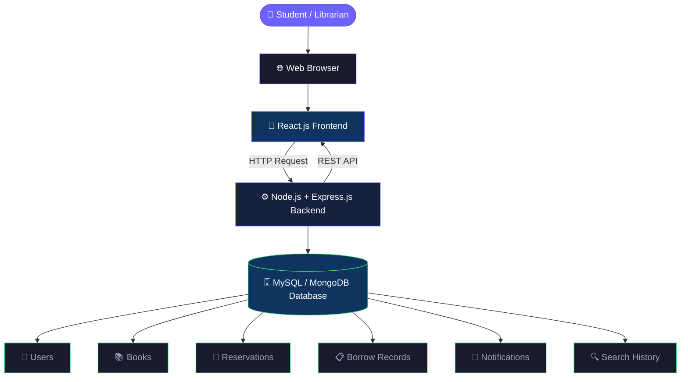

# SmartLib – Smart Digital Library Book Reservation System

---

## 1. Problem Statement

Students often visit the college library only to discover that the book they need is already borrowed or difficult to locate. There is no online system to check book availability, reserve unavailable books, or track reservation status without visiting the library physically.

This creates inconvenience for students and increases manual work for librarians.

---

## 2. Proposed Solution

SmartLib is a full-stack web application that allows students to search books online, check real-time availability, find the exact shelf location, reserve unavailable books, and receive notifications when books become available.

Librarians can manage books, reservations, students, borrowing records, and book demand through an admin dashboard.

---

## 3. Test Track

The SmartLib system will be tested to ensure that all major features work correctly and provide a smooth experience for students and librarians.

### Test Cases

| Test ID | Feature | Test Case | Expected Result |
|---|---|---|---|
| T01 | Login | Enter valid student credentials | Student dashboard opens |
| T02 | Login | Enter invalid credentials | Error message is displayed |
| T03 | Search | Search for an existing book | Matching books are displayed |
| T04 | Availability | Check an available book | Book shows "Available" |
| T05 | Availability | Check a borrowed book | Book shows "Currently Borrowed" |
| T06 | Reservation | Reserve an unavailable book | Student is added to reservation queue |
| T07 | Queue | Check reservation position | Correct queue position is displayed |
| T08 | Notification | Reserved book becomes available | Student receives notification |
| T09 | Librarian | Add a new book | Book appears in catalogue |
| T10 | Librarian | Update book availability | Updated status is displayed |
| T11 | Recommendation | Search/view books | Relevant recommendations are displayed |
| T12 | Security | Student opens librarian page | Access is denied |

### Testing Flow

```text
Login
  ↓
Search Book
  ↓
Check Availability
  ↓
 ┌───────────────┐
 │ Book Available?│
 └───────┬───────┘
     YES │ NO
         │
    ┌────┴─────┐
    ↓          ↓
 Borrow      Reserve
 Book        Book
               ↓
          Join Queue
               ↓
       Book Available
               ↓
          Notification
               ↓
          Collect Book
```

---

## 4. System Architecture



---

## 5. Tech Stack

| Layer | Technology |
|---|---|
| Frontend | React.js + Vite |
| Backend | Node.js + Express.js |
| Database | MySQL / MongoDB |
| API | REST API |
| Auth | JWT (JSON Web Tokens) |

---

## 6. Team

### 👥 Team Name: DevSquad

| Name | Role | GitHub |
|---|---|---|
| Sridhar Venkataraman | Team Lead & Full Stack | [@sridharvenkataraman7-web](https://github.com/sridharvenkataraman7-web) |
| Madhumitha S | Frontend Developer | [@madhumithas2213-hash](https://github.com/madhumithas2213-hash) |
| Kiruthikkesh S | Backend Developer | [@skiruthikkesh-alt](https://github.com/skiruthikkesh-alt) |

---

## 7. Branch Structure

| Branch | Owner | Purpose |
|---|---|---|
| `main` | DevSquad | Stable release – all branches merge here |
| `feature/sridharvenkataraman7-web` | Sridhar | Full stack features |
| `feature/madhumithas2213-hash` | Madhumitha | Frontend UI |
| `feature/skiruthikkesh-alt` | Kiruthikkesh | Backend API |

---

## 8. Unique Feature Flow

**Search → Find Shelf → Reserve → Track Queue → Notification → Smart Recommendation**
